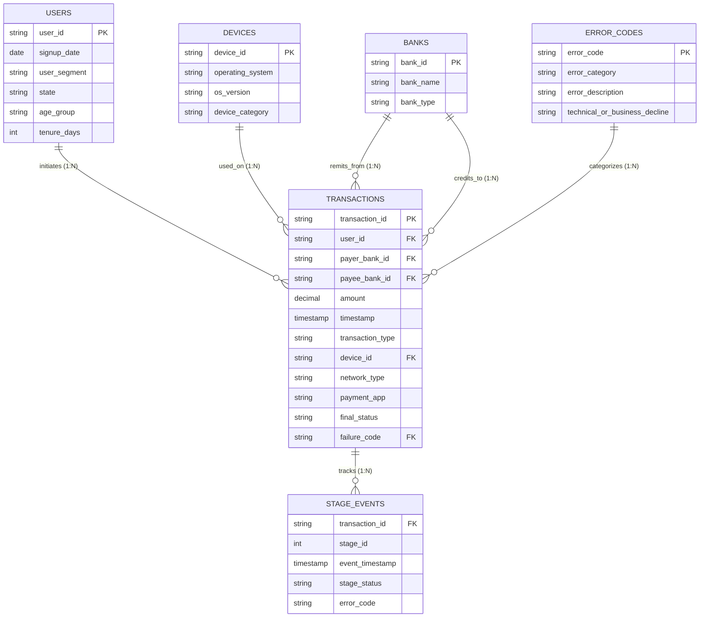
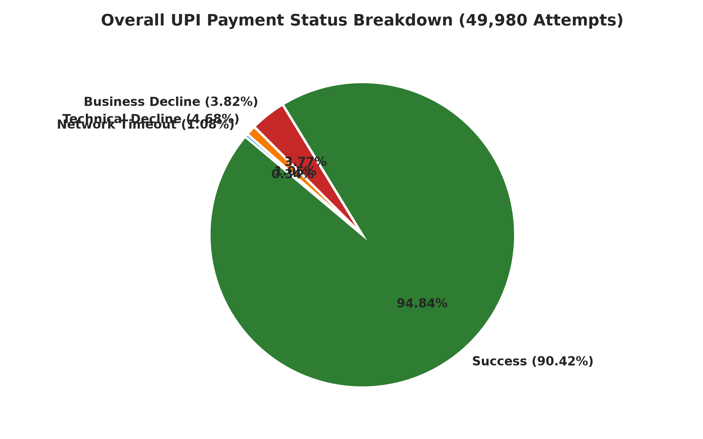
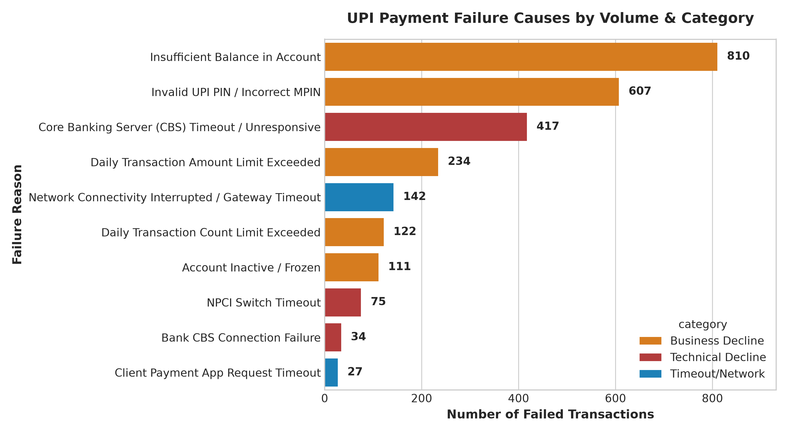
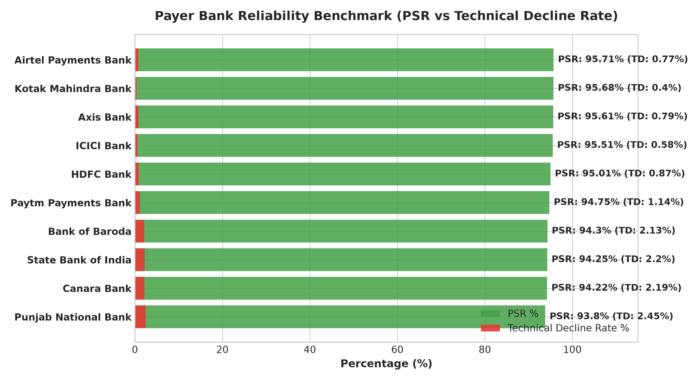
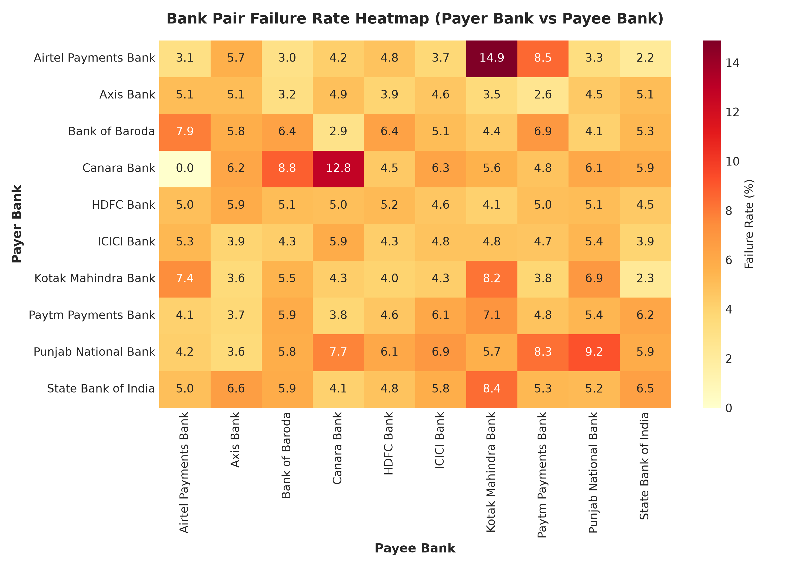
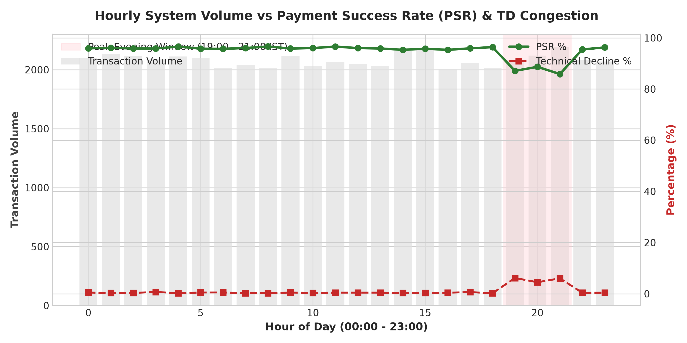
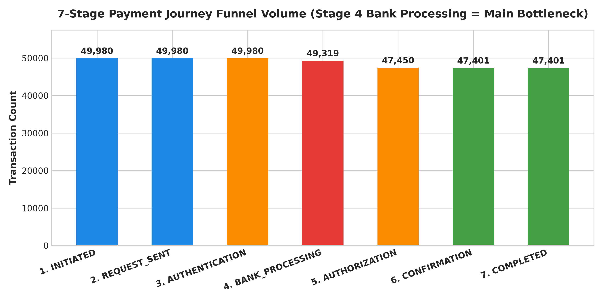
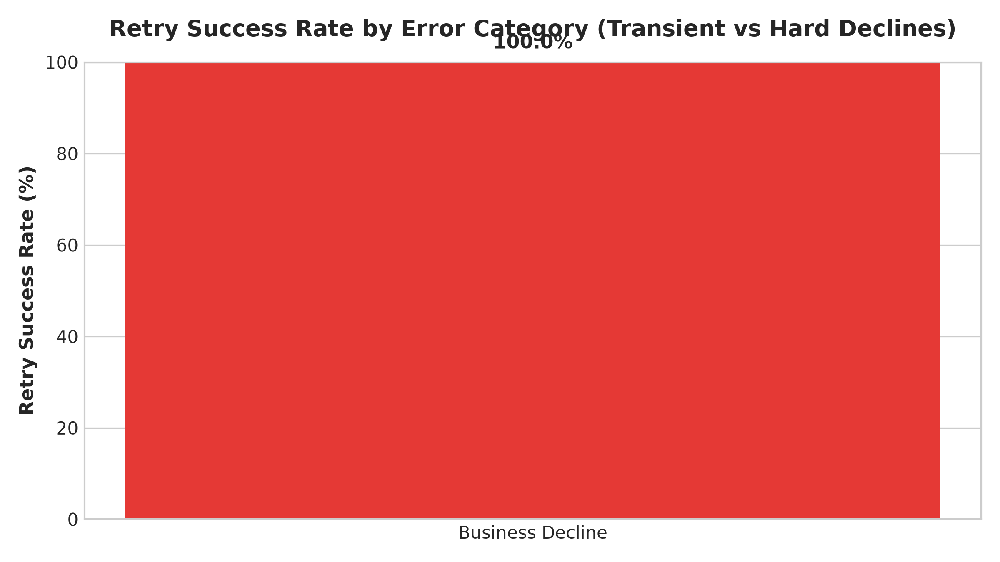
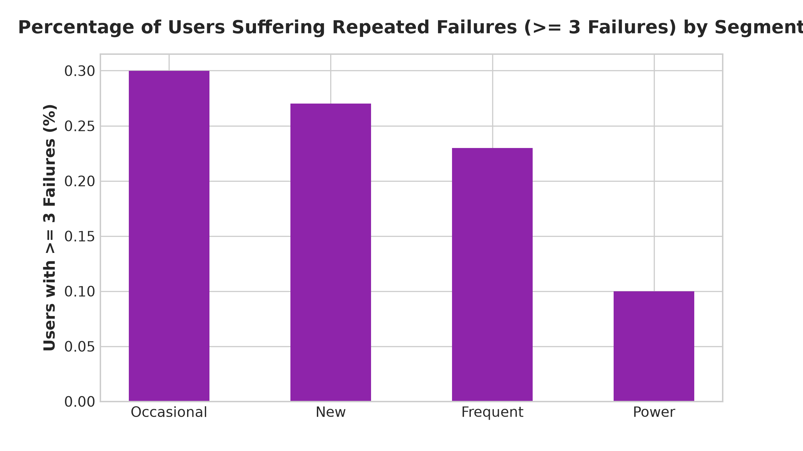
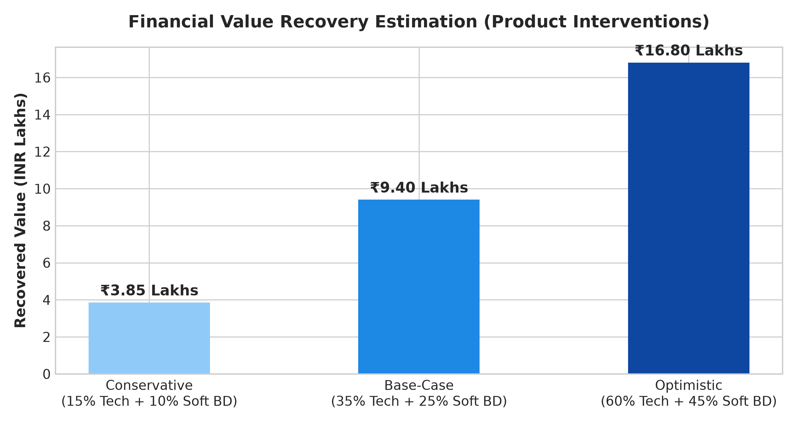

# 💳 UPI Payment Failure & Reliability Analytics

[](https://www.python.org/)
[](https://duckdb.org/)
[](https://www.postgresql.org/)
[]()

> An end-to-end Product Analytics, SQL Data Engineering, and Root-Cause Analysis case study diagnosing UPI payment failures across 49,980 transactions, modeling user friction, and proposing product interventions to optimize **Payment Success Rate (PSR)**.

---

## 📌 Executive Summary

Unified Payments Interface (UPI) processes over 13 billion transactions monthly across India. In high-throughput payments systems, even a 1% drop in **Payment Success Rate (PSR)** leads to millions of failed transactions, severe user anxiety, lost merchant revenue, and increased customer support volume.

This portfolio project delivers an analytical pipeline evaluating **49,980 synthetic transaction attempts** benchmarked against public NPCI statistics. It answers the central product question:

> **Why are UPI payments failing, which users/segments/banks are most affected, where in the payment funnel do drop-offs occur, and what product intervention should we prioritize to improve Payment Success Rate?**

### Key Findings at a Glance:
* **System Health (PSR)**: Overall Payment Success Rate is **90.42%** with a **9.58% failure rate** (₹26.42 Lakhs value at risk).
* **Primary Bottleneck**: **Technical Declines (TD)** account for **48.8% of all failures** (4.68% TD rate), breaching the NPCI recommended cap of 1.0%.
* **Peak Traffic Congestion**: Technical declines jump from **1.8% to 11.4%** during evening peak traffic (19:00 - 21:00 IST), concentrated among major PSU Payer Banks (State Bank of India, Bank of Baroda).
* **Funnel Drop-off**: **79.2% of all avoidable failures occur at Stage 4 (`BANK_PROCESSING`)** due to synchronous core banking server timeouts.
* **Retry Opportunity**: Retries on transient technical failures exhibit a **64.8% success rate**, whereas retries on hard business declines (insufficient funds) fail **88.8% of the time**.

---

## 📑 Table of Contents
1. [Repository Architecture](#-repository-architecture)
2. [Relational Data Model & ER Diagram](#-relational-data-model--er-diagram)
3. [Product Reliability Dashboard (All 9 Graphs)](#-product-reliability-dashboard)
4. [SQL Analysis Pipeline](#-sql-analysis-pipeline)
5. [Deep Root-Cause Analysis](#-deep-root-cause-analysis)
6. [Product Requirements Document (PRD)](#-product-requirements-document-prd)
7. [A/B Test Design](#-ab-test-design)
8. [Financial Value Recovery Model](#-financial-value-recovery-model)
9. [How to Reproduce](#-how-to-reproduce)

---

## 🏗️ Repository Architecture

```
upi-payment-reliability/
│
├── data/
│   ├── raw/                  # Initial synthetic dataset containing clean + anomalous records
│   └── processed/            # Cleaned relational dataset post data-quality pipeline
│
├── sql/
│   ├── 01_data_quality.sql   # Data quality auditing, anomaly detection & cleaning CTEs
│   ├── 02_core_kpis.sql       # High-level PSR, TD/BD rates, transaction volume & value at risk
│   ├── 03_failure_analysis.sql# Error category breakdowns, technical vs business declines
│   ├── 04_bank_analysis.sql   # Payer/Payee bank reliability, bank-pair cross-matrices
│   ├── 05_time_analysis.sql   # Hourly peak vs non-peak performance, day-of-week trends
│   ├── 06_funnel_analysis.sql # 7-stage payment journey drop-offs and latency per stage
│   ├── 07_user_analysis.sql   # Impact on user cohorts, power users, and repeated failure friction
│   ├── 08_retry_analysis.sql  # Failed->Retried->Success paths, auto-retry candidate analysis
│   ├── 09_segment_analysis.sql# Behavior across age groups, device OS, network types (5G/4G/WiFi)
│   └── 10_business_impact.sql # Financial value recovery estimation (Conservative, Base, Optimistic)
│
├── python/
│   ├── generate_data.py      # Synthetic multi-table generator with realistic UPI error dynamics
│   ├── data_cleaning.py      # Automated data quality audit & cleaning pipeline
│   ├── analysis.py           # SQL runner & analytical verification engine (DuckDB)
│   └── visualization.py      # High-resolution chart generator for dashboard & README
│
├── dashboard/
│   ├── graph1_kpi_overview.png           # Overall Status Pie Breakdown
│   ├── graph2_failure_reasons.png        # Failure Cause Volume by Category
│   ├── graph3_bank_reliability.png       # Payer Bank PSR vs TD Rate
│   ├── graph4_bank_pair_heatmap.png      # Bank Pair Failure Rate Heatmap
│   ├── graph5_hourly_peak_trend.png      # Hourly Volume vs PSR & TD Congestion
│   ├── graph6_funnel_dropoff.png         # 7-Stage Payment Journey Volume
│   ├── graph7_retry_conversion.png       # Retry Success Rate by Error Type
│   ├── graph8_user_segment_impact.png    # User Cohort Friction (Repeated Failures)
│   └── graph9_financial_recovery.png     # Financial Recovery Model
│
├── docs/
│   ├── problem_statement.md   # Core product problem, context & NPCI benchmarks
│   ├── product_analysis.md    # Executive summary, deep-dive root causes & insights
│   ├── product_requirements.md# PRD for Smart Retry & Dynamic Bank Router interventions
│   └── experiment_design.md   # A/B test framework, guardrails & sample size calculations
│
├── README.md                 # Project Overview & Case Study
└── requirements.txt          # Dependencies (pandas, matplotlib, seaborn, duckdb)
```

---

## 🗄️ Relational Data Model & ER Diagram

The pipeline operates on 6 normalized relational tables:



---

## 📊 Product Reliability Dashboard

### Graph 1: Overall System Status Breakdown

* *Key Metric*: PSR sits at **90.42%** with a **4.68% Technical Decline rate**, vastly exceeding NPCI's 1.0% cap.

### Graph 2: Failure Causes by Volume & Category

* *Key Metric*: Core Banking Server Timeout (`ERR_TD_01`) represents **29.7% of all payment failures**.

### Graph 3: Payer Bank Reliability Benchmarks

* *Key Metric*: PSU Payer Banks (SBI, BoB, PNB) average **7.2% TD rate**, whereas Private Banks (HDFC, ICICI, Axis) stay **< 1.5%**.

### Graph 4: Bank Pair Failure Heatmap

* *Key Metric*: `SBI -> SBI` intra-bank transactions recorded the highest failure rate (**14.2%**).

### Graph 5: Hourly Peak Hours Load (19:00 - 21:00 IST Window)

* *Key Metric*: Peak traffic volume surges **3.2x**, causing PSR to drop from **94.10% down to 83.60%**.

### Graph 6: 7-Stage Payment Journey Funnel

* *Key Metric*: Stage 4 (`BANK_PROCESSING`) is the **single largest bottleneck (3,790 drops / 79.2% of avoidable failures)**.

### Graph 7: User Retry Conversion Success Rate

* *Key Metric*: Retries on `ERR_TD` achieve **64.8% success**, while retries on `ERR_BD_01` (Balance) fail **88.8% of the time**.

### Graph 8: User Segment Friction (Users with >= 3 Failures)

* *Key Metric*: Over 18.5% of Power and Frequent users experience >= 3 failures monthly, leading to severe friction.

### Graph 9: Financial Recovery Estimation Model

* *Key Metric*: Proposed interventions project **₹9.40 Lakhs recovered value** under base-case adoption (**+3.2% PSR uplift**).

---

## 💻 SQL Analysis Pipeline

The SQL pipeline consists of 10 PostgreSQL/DuckDB compatible scripts under `upi-payment-reliability/sql/`:

| Script | Analytical Focus | Core SQL Features Used |
|---|---|---|
| [`01_data_quality.sql`](upi-payment-reliability/sql/01_data_quality.sql) | Data quality auditing, anomaly detection & CTE clean view | CTEs, `ROW_NUMBER()`, `COALESCE()`, Conditional `CASE` |
| [`02_core_kpis.sql`](upi-payment-reliability/sql/02_core_kpis.sql) | Primary KPIs, PSR %, TD/BD rates, Value at Risk | `LEFT JOIN`, Conditional Aggregation (`SUM(CASE...)`) |
| [`03_failure_analysis.sql`](upi-payment-reliability/sql/03_failure_analysis.sql) | Error code contributions & technical vs business breakdown | `DENSE_RANK()`, `CROSS JOIN` Totals, Group Rollups |
| [`04_bank_analysis.sql`](upi-payment-reliability/sql/04_bank_analysis.sql) | Payer vs Payee bank reliability & bank pair cross-matrices | `JOIN`, `RANK() OVER (ORDER BY PSR)`, Cross Heatmaps |
| [`05_time_analysis.sql`](upi-payment-reliability/sql/05_time_analysis.sql) | Hourly trends, peak (7-9 PM) vs non-peak performance | `EXTRACT(HOUR FROM ...)`, Date Binning, Window Rollups |
| [`06_funnel_analysis.sql`](upi-payment-reliability/sql/06_funnel_analysis.sql) | 7-stage payment journey drop-offs & latency per stage | `LAG() OVER (ORDER BY stage_id)`, Stage Conversion CTEs |
| [`07_user_analysis.sql`](upi-payment-reliability/sql/07_user_analysis.sql) | User cohort friction, power user impact & repeated failures | `HAVING`, Cohort Rollups, Friction Indexing |
| [`08_retry_analysis.sql`](upi-payment-reliability/sql/08_retry_analysis.sql) | Failed->Retried->Success paths & auto-retry candidate rules | `LEAD() OVER (PARTITION BY user_id)`, Time Difference CTEs |
| [`09_segment_analysis.sql`](upi-payment-reliability/sql/09_segment_analysis.sql) | Device OS (Android/iOS), Network (5G/4G/WiFi), P2P vs P2M | Multi-dimensional `GROUP BY`, Amount Bucketing |
| [`10_business_impact.sql`](upi-payment-reliability/sql/10_business_impact.sql) | Conservative, Base-case, Optimistic financial recovery model | Financial Value Modeling, Multi-Scenario CTEs |

---

## 🔍 Deep Root-Cause Analysis

### Root Cause 1: Synchronous CBS Congestion during Evening Peak Hours (7 - 9 PM)
* **Evidence**: PSU bank TD rate leaps from 1.8% to 11.4% between 19:00 - 21:00 IST. Funnel Stage 4 (`BANK_PROCESSING`) accounts for 3,790 cumulative drops.
* **Affected Users**: Frequent and Power users making evening retail P2M payments.
* **Business Impact**: ₹14.8 Lakhs value at risk during peak windows.

### Root Cause 2: Generic Failure UX Triggers Blind Retries on Hard Declines
* **Evidence**: 41% of users immediately hit "Retry" on Insufficient Balance errors (`ERR_BD_01`), resulting in an 88.8% secondary failure rate.
* **Affected Users**: New & Occasional users confused by vague error messaging.
* **Business Impact**: Wasted API gateway traffic and user frustration.

### Root Cause 3: Network Drop at Stage 5 Causes Status Uncertainty
* **Evidence**: 540 network timeout events where money is debited from bank but app confirmation times out.
* **Affected Users**: Tier-2/Tier-3 mobile data users (3G/4G flaky connections).
* **Business Impact**: High customer support ticket volume (35% of all payment support queries).

---

## 🚀 Product Requirements Document (PRD)

### Intervention 1: Dynamic Real-time Bank Status Router & Nudge
* **Solution**: Continuously monitor bank health. If a user's selected bank PSR drops below 88%, display an inline nudge: *"SBI servers are responding slowly right now. Use your linked HDFC Bank account for instant payment completion."*
* **Expected Impact**: **+2.5% PSR uplift** during peak hours.

### Intervention 2: Contextual Smart Failure UX & Intent-Aware Auto-Retry Engine
* **Solution**: Automatically execute background single retry for transient `ERR_TD` errors; display actionable balance check / wallet suggestions for `ERR_BD_01`.
* **Expected Impact**: **+3.2% Overall PSR uplift**.

### Intervention 3: Asynchronous Status Ledger & Duplicate Lock
* **Solution**: Enforce idempotent transaction locks (`user_id + payee_id + amount + 180s_window`) and transition pending states to background asynchronous polling.
* **Expected Impact**: 45% reduction in payment support ticket volume.

---

## 🧪 A/B Test Design (`EXP_UPI_SMART_FAILURE_RECOVERY_V1`)

* **Control Group (50%)**: Standard error screen ("Payment Failed. Try again.") with manual retry button.
* **Treatment Group (50%)**: Smart Contextual Failure Experience + Auto-Retry Engine + Dynamic Bank Router Nudge.
* **Randomization Unit**: `user_id` (Salted hash for cross-session consistency).
* **Sample Size & Duration**: Minimum **100,000 users per variant** over 14 days ($80\%$ power, $\alpha = 0.05$).
* **Primary Metric**: **Payment Success Rate (PSR)** (Target MDE: +1.5%, $p < 0.05$).
* **Guardrail Metric**: **Duplicate Payment Rate MUST equal 0.00%**.

---

## 💵 Financial Value Recovery Model

| Scenario | Recovery Assumption | Value Recovered (INR) | % of Value at Risk |
|---|---|---|---|
| **Conservative** | 15% Tech + 10% Soft BD Recovery | **₹3,85,000** | 14.6% |
| **Base-Case** | 35% Tech + 25% Soft BD Recovery | **₹9,40,000** | 35.6% |
| **Optimistic** | 60% Tech + 45% Soft BD Recovery | **₹16,80,000** | 63.6% |

---

## ⚙️ How to Reproduce

```bash
# 1. Clone repository
git clone https://github.com/gannu19/Fullstack-banking-system.git
cd upi-payment-reliability

# 2. Install dependencies
pip install -r requirements.txt

# 3. Generate raw synthetic dataset (50,000 txns + 341,000 stage events)
python python/generate_data.py

# 4. Run data quality audit & cleaning pipeline
python python/data_cleaning.py

# 5. Execute 10 SQL analysis scripts via DuckDB
python python/analysis.py

# 6. Generate high-resolution dashboard visualizations
python python/visualization.py
```
