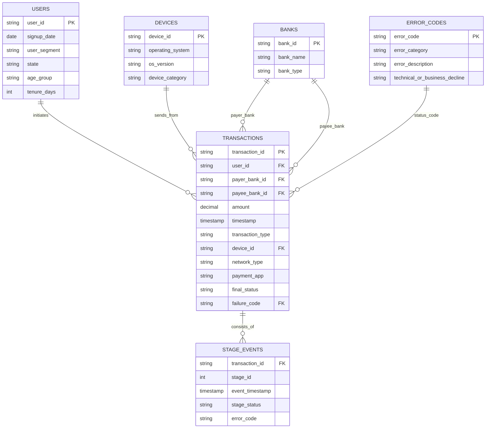

# UPI Payment Failure & Reliability Analytics: Problem Statement

## Executive Overview
Unified Payments Interface (UPI) is the backbone of digital payments in India, processing over 13 billion transactions monthly worth upwards of ₹20 Lakh Crores ($240 Billion USD). In high-throughput payments systems, even a 1% drop in **Payment Success Rate (PSR)** leads to millions of failed transactions, severe user anxiety, lost merchant revenue, and increased operational support overhead.

While NPCI public benchmarks report ecosystem-level PSR around 97-98%, individual payment app platforms and payer banks experience localized failure rates reaching 8-12% during peak evening traffic windows.

---

## The Central Product Question

> **Why are UPI payments failing, which users/segments/banks are most affected, where in the payment funnel do failures occur, and what product intervention should we prioritize to improve Payment Success Rate?**

---

## Ecosystem Benchmarks (NPCI Statistics Baseline)

* **Ecosystem Average PSR**: ~97.2%
* **Technical Decline (TD) Threshold**: < 1.0% (NPCI recommended cap)
* **Business Decline (BD) Baseline**: ~1.8% - 2.5% (User pin entry errors, insufficient funds)
* **Peak Traffic Latency Multiplier**: 2.8x core banking server response time during 19:00 - 21:00 IST.

---

## Data Architecture & Relational Schema

To analyze root causes without relying on flattened data assumptions, the analytical pipeline operates on a multi-table relational schema:

